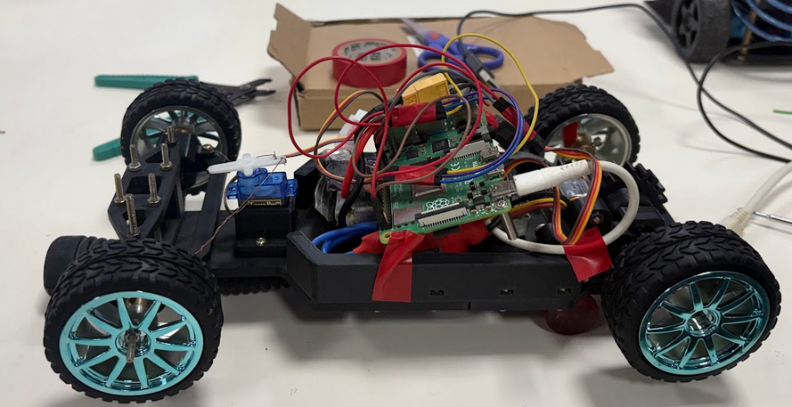
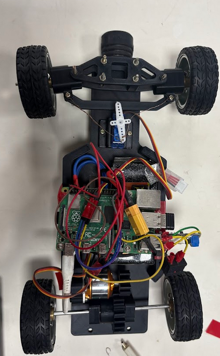
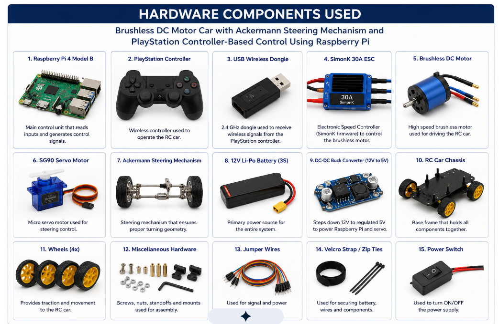
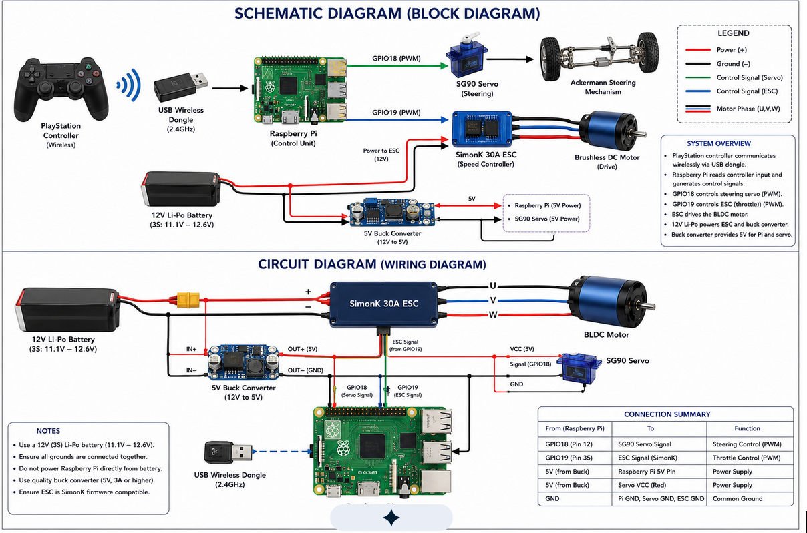

# RPi-Ackermann-Drive-Car

A Raspberry Pi-based Ackermann steering robot car powered by a BLDC motor and controlled using a joystick. The project integrates embedded systems, motor control, mechanical design, and robotics to provide smooth throttle and steering control through a custom-built vehicle platform.

<div align="center">

</div>

<div align="center">

</div>


---

## Features

- Ackermann steering mechanism for realistic vehicle movement
- BLDC motor-based propulsion system
- Servo motor steering control
- Real-time joystick-based driving
- Raspberry Pi as the main controller
- Custom-designed and 3D-printed chassis components
- Modular hardware and software architecture
- GitHub documentation for design, assembly, and implementation

<div align="center">

</div>

---

## Hardware Components

- Raspberry Pi
- BLDC Motor
- Electronic Speed Controller (ESC)
- Servo Motor
- USB Joystick
- Battery Pack
- Ackermann Steering Assembly
- Custom 3D-Printed Parts
- Wheels and Chassis Components

<div align="center">

</div>

---

## System Architecture

```text
Joystick
    |
    v
Raspberry Pi
    |
    +------> ESC ------> BLDC Motor
    |
    +------> Servo Motor ------> Steering Mechanism
```

The joystick inputs are processed by the Raspberry Pi, which generates control signals for:

- BLDC motor throttle through the ESC
- Steering angle through the servo motor

<div align="center">

</div>

---

## Mechanical Design

The vehicle was designed using CAD software and fabricated using 3D printing techniques.

### Design Highlights

- Ackermann steering geometry
- Lightweight chassis design
- Servo-based steering linkage
- BLDC motor mounting assembly
- Modular structure for easy maintenance

---

## Software Workflow

1. Read joystick inputs.
2. Process throttle and steering commands.
3. Generate PWM signals.
4. Control BLDC motor speed through ESC.
5. Control steering angle using servo motor.
6. Update vehicle motion in real time.

---

## Project Contributions

- Designed and developed an Ackermann steering robot car using a BLDC motor and servo-based steering mechanism.
- Created custom CAD models and fabricated components using 3D printing.
- Implemented joystick-based throttle and steering control.
- Used Raspberry Pi as the primary processing and control unit.
- Integrated ESC and servo motor control for smooth vehicle operation.
- Documented the complete project workflow and source code on GitHub.

---

## Repository Structure

```text
RPi-Ackermann-Drive-Car/
│
├── images/
│   ├── chassis_design.png
│   ├── robot_car.jpg
│
├── src/
│   ├── joystick_control.py
│   ├── motor_controller.py
│   ├── steering_controller.py
│
├── docs/
│   ├── assembly_guide.md
│   ├── wiring_diagram.md
│
├── README.md
└── requirements.txt
```

---

## Applications

- Robotics Education
- Autonomous Vehicle Research
- Embedded Systems Learning
- Motion Control Experiments
- Ackermann Steering Demonstration
- Remote Vehicle Control

---

## Future Improvements

- Wireless control using Wi-Fi
- Camera-based navigation
- Autonomous waypoint following
- ROS2 integration
- Obstacle detection and avoidance
- Mobile application support

---

## Results

- Successful implementation of Ackermann steering.
- Smooth BLDC motor speed control.
- Responsive joystick-based operation.
- Stable real-time control using Raspberry Pi.
- Functional prototype built using custom 3D-printed components.

---

## Author

Developed as part of a robotics and embedded systems project focusing on vehicle dynamics, motor control, mechanical design, and Raspberry Pi-based automation.

---
